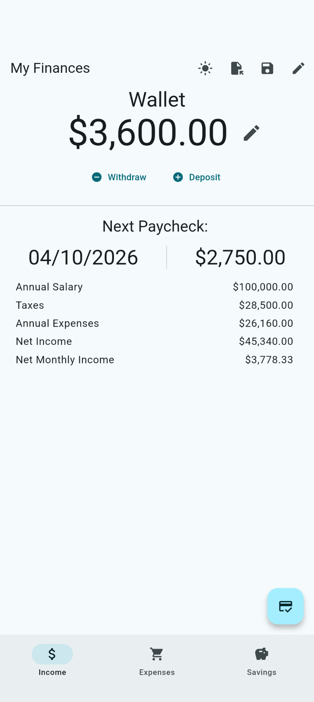
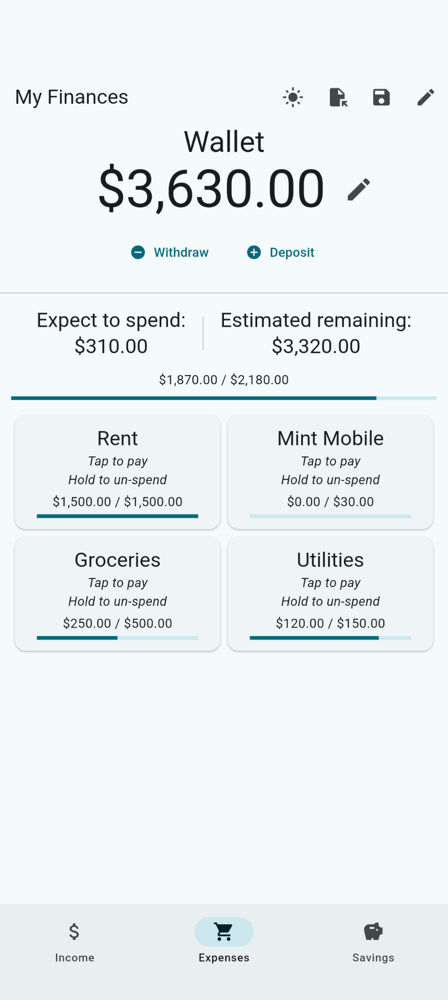
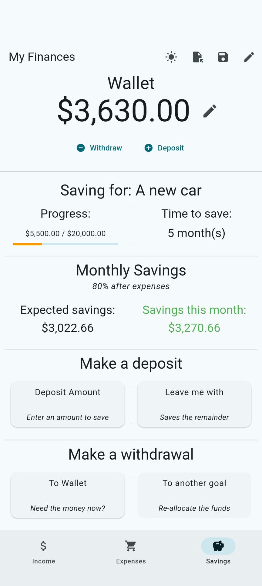

# Finances Tracker

A mobile/desktop app to help track your income, expenses, and savings goals

## Features

### General

- No Pro features or subscriptions
- Your data is not sent off the device and is completely private
- You can export / import your data as JSON for personal use or backups
- Dark mode!

### Income

- Enter your paycheck and yearly salary to quickly calculate annual withholdings
- 1-tap button to add a paycheck to your wallet

### Expenses

- Budget expenses by categories you choose
- Set up recurring expenses: daily, monthly, or yearly
- 1-tap option to pay off a "lump sum" expense, like rent
- At-a-glance view of your projected expenses for the rest of the month

### Savings

- Set up savings goals, or just unlimited funds to toss extra money into
- Track progress to your goal with a calculation of how many months you'll need
  to save
- Deposit any amount, or use the "leave me with" option to save all extra money
  in your wallet
- Withdraw from savings back into your wallet, or transfer it to another savings
  goal
- Savings goals are smart and won't transfer more money than you're saving for
- 1-tap option to deposit 80% of your leftover monthly income to your savings
  goal

## Gallery

| Income page              | Expenses page              | Savings page              |
| ------------------------ | -------------------------- | ------------------------- |
|  |  |  |

## Installing

At this time, no releases are offered on GitHub. However, it is extremely simple
to compile this for yourself:

1. Install [Flutter](https://docs.flutter.dev/install)
2. Clone the repository, or download it as a ZIP folder
3. In a terminal, run the correct build command for your platform:
   - MacOS: `flutter build macos`
   - Windows: `flutter build windows`
   - Linux: `flutter build linux`
   - Android: `flutter build apk`
   - iPhone: `flutter build ipa` (only available on a MacOS device)
4. On desktop, simply run the executable. On mobile:
   - Connect your device to your PC via USB
   - Enable USB debugging on your phone
     ([Android](https://developer.android.com/studio/debug/dev-options),
     [iOS](https://developer.apple.com/documentation/xcode/enabling-developer-mode-on-a-device))
   - Run `flutter devices` to confirm it shows up (accept any prompts on your
     device)
   - Run `flutter install` to install the app
